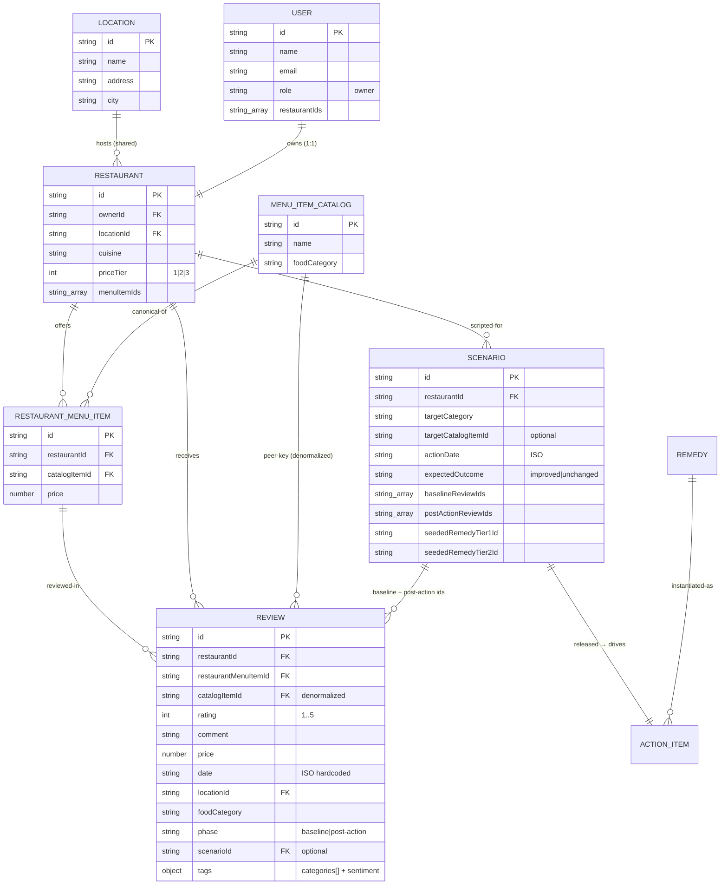

# RIA — Data Architecture Plan

> **Owner:** Data Architect Agent · **Consumes:** product-plan.md · **Feeds:** analysis-plan, frontend-plan, qa-plan

This document is the **canonical type & data reference** for the Review Impact Analysis
(RIA) MVP. Every enum value, interface field, entity relationship, ID convention, and mock
record described here is authoritative. The analysis, frontend, and QA plans reference these
names verbatim — if a name appears here it must appear identically in their docs and in the
generated code under `src/types/` and `src/data/`.

RIA is an **Experience.com / XMP (Experience Management Platform) review-intelligence
capability**, demoed on the restaurant vertical — the "close the loop on negative feedback"
capability for multi-location brands. The data model below is deliberately shaped so a
single owner's restaurant sits inside a **cross-restaurant peer graph** (shared locations,
shared menu catalog) — that is what makes peer benchmarking, and therefore the whole
before/after story, defensible rather than anecdotal.

---

## 1. Scope & responsibilities of this layer

The data layer owns everything under `src/types/` and `src/data/`. It provides:

1. A frozen **type system** (`src/types/`) that every other layer imports.
2. A **deterministic seed corpus** (`src/data/`) — locations, owners, restaurants, a
   canonical menu catalog, per-restaurant menu offerings, ~139 reviews, 6 scripted
   scenarios, and a remedy table — bundled into a single `SeedData` object.
3. **Ground-truth `tags`** on every demo review so analysis is reproducible.
4. A single seeded PRNG (`prng.ts`, mulberry32) — the *only* source of "randomness".

The data layer contains **no business logic and no React/AntD/Zustand imports**. Services
consume `SeedData` as a plain argument and recompute everything on read; nothing computed is
persisted.

---

## 2. Entities & relationships

### 2.1 Entity roster

| Entity | File | Purpose | Key relationships |
|---|---|---|---|
| `Location` | `locations.ts` | A physical place; **shared** across restaurants | 1 Location → N Restaurants |
| `User` | `users.ts` | Restaurant owner (`role:'owner'`) | 1 User → 1 Restaurant (`restaurantIds`) |
| `Restaurant` | `restaurants.ts` | An owned venue | N:1 to User, N:1 to Location, 1:N to RestaurantMenuItem |
| `MenuItemCatalog` | `menuCatalog.ts` | **Canonical** cross-restaurant dish (the peer anchor) | 1 Catalog item → N RestaurantMenuItem |
| `RestaurantMenuItem` | `restaurantMenuItems.ts` | A restaurant's concrete offering of a catalog item, with its own `price` | N:1 to Restaurant, N:1 to MenuItemCatalog |
| `Review` | `reviews.ts` | A single 1–5★ review with authored `tags` | N:1 to Restaurant, N:1 to RestaurantMenuItem, denormalized `catalogItemId` |
| `Scenario` | `scenarios.ts` | A scripted before/after demo case | N:1 to Restaurant; owns two review-id sets |
| `Remedy` (table) | `remedyTable.ts` | Specific fixes per `ProblemCategory` (tiered) | keyed by `ProblemCategory` |
| `ActionItem` | *(runtime, in store — not seeded)* | An owner's action derived from a Remedy + RootCause | N:1 to Restaurant, references Remedy/RootCause/Scenario |

**Analysis/impact result types** (`DetectedProblem`, `PeerComparisonResult`,
`PositiveReviewComparison`, `RootCause`, `Remedy`, `ReviewAnalysis`, `MetricSnapshot`,
`ImpactResult`) are **computed, never seeded** — services build them on read from the seed
corpus. They are defined in §4 so all layers share one vocabulary.

### 2.2 Cardinalities (the fixed business shape)

- **10 owners → 10 restaurants**, exactly one each (`User.restaurantIds` length 1;
  `Restaurant.ownerId` unique).
- **Shared locations:** 5 `Location` rows, each shared by 2 restaurants (10 restaurants → 5
  locations, 2:1). Location sharing is what lets "similar restaurants in the same area" be a
  real peer set.
- **Shared menu items:** a `MenuItemCatalog` row is offered by **multiple** restaurants via
  distinct `RestaurantMenuItem` rows (different prices). This many-to-many-through join is
  the peer-comparison anchor.
- **≥10 reviews per restaurant** (baseline). Scenario restaurants additionally carry a
  hidden post-action review set.
- A **single review may carry multiple problems** (`tags.categories` is an array).

### 2.3 ER diagram



**Linking path (load-bearing):** `Review → RestaurantMenuItem → MenuItemCatalog` gives
cross-restaurant comparability; peer comparison **joins on `catalogItemId`**.
`ActionItem.scenarioId` connects an owner's action to its post-action review set, which is
what `impactAnalysisService.computeImpact` reads once the scenario is released.

---

## 3. Two-level menu model (peer comparison anchor)

The menu is deliberately split into **two tables** so that price and rating can be compared
across restaurants for the *same dish*:

| Table | Grain | Fields | Role |
|---|---|---|---|
| `MenuItemCatalog` | one row per canonical dish (global) | `id`, `name`, `foodCategory` | The shared identity — "Margherita Pizza" is one catalog id everywhere |
| `RestaurantMenuItem` | one row per (restaurant × catalog dish) | `id`, `restaurantId`, `catalogItemId`, `price` | The per-restaurant offering, carrying that restaurant's own price |

Peer comparison is a **join on `catalogItemId`**: given restaurant R's offering of catalog
item C, `peerComparisonService.getPeerItems(catalogItemId, excludeRestaurantId, data)`
selects every *other* `RestaurantMenuItem` with the same `catalogItemId`, then aggregates
their prices and the ratings of reviews pointing at them.

### Worked example — "Margherita Pizza" (`cat-01`)

Four restaurants offer the same catalog dish at different prices:

| RestaurantMenuItem id | Restaurant | `catalogItemId` | `price` |
|---|---|---|---|
| `rmi-01-01` | `rst-01` Bella Napoli (Italian, tier 3) | `cat-01` | **$16.00** |
| `rmi-06-01` | `rst-06` Pizza Corner (Pizza, tier 2) | `cat-01` | $12.50 |
| `rmi-07-01` | `rst-07` Mediterraneo (Mediterranean, tier 2) | `cat-01` | $14.00 |
| `rmi-10-01` | `rst-10` Café Aroma (Café, tier 1) | `cat-01` | $11.00 |

For Bella Napoli (`rst-01`, the Scenario-1 restaurant), `comparePeers('rst-01','cat-01',data)`
yields a `PeerComparisonResult`:

- `myPrice` = 16.00; `peerAvgPrice` = (12.50 + 14.00 + 11.00) / 3 = **12.50**
- `priceDeltaPct` = (16.00 − 12.50) / 12.50 = **+28.0%**
- `pricePercentile` = **100** (most expensive of 4); `rank` = 1 of `peerCount` 4
- `myAvgRating` (from Bella Napoli's Margherita reviews) ≈ 2.1; `peerAvgRating` ≈ 4.0 →
  `ratingGap` ≈ **−1.9**

That single result powers the "you charge 28% above peers yet rate lower" narrative in
Scenario 1 — exactly the multi-location benchmarking Experience.com sells.

---

## 4. Full TypeScript interface & enum catalog (canonical)

Reproduce these **verbatim** across the codebase. Types live in
`src/types/{enums,domain,analysis,impact}.ts` and are re-exported from `src/types/index.ts`.
The `Scenario` interface lives in `src/data/scenarios.ts`.

### 4.1 `src/types/enums.ts`

```ts
export enum ProblemCategory {
  Price='Price', Quality='Quality', Quantity='Quantity', Taste='Taste',
  Service='Service', WaitingTime='WaitingTime', Availability='Availability',
  Staff='Staff', Cleanliness='Cleanliness', Menu='Menu',
  Ambience='Ambience', Delivery='Delivery', Packaging='Packaging',
} // 13 categories
export enum Sentiment { Positive='Positive', Neutral='Neutral', Negative='Negative' }
export enum ReviewPhase { Baseline='baseline', PostAction='post-action' }
export enum Priority { High='High', Medium='Medium', Low='Low' }
export enum ActionStatus {
  NotStarted='Not Started', InProgress='In Progress', Monitoring='Monitoring',
  Completed='Completed', ImprovementConfirmed='Improvement Confirmed',
  NoSignificantChange='No Significant Change',
} // the 6 required statuses
export type Rating = 1|2|3|4|5;
```

### 4.2 `src/types/domain.ts`

```ts
export interface Location { id: string; name: string; address: string; city: string; }
export interface User { id: string; name: string; email: string; role: 'owner'; restaurantIds: string[]; }
export interface Restaurant {
  id: string; name: string; ownerId: string; locationId: string;
  cuisine: string; priceTier: 1|2|3; menuItemIds: string[];
}
// Canonical cross-restaurant item — THE peer-comparison anchor
export interface MenuItemCatalog { id: string; name: string; foodCategory: string; }
// A restaurant's concrete offering of a catalog item, with its own price
export interface RestaurantMenuItem { id: string; restaurantId: string; catalogItemId: string; price: number; }
export interface Review {
  id: string; restaurantId: string; restaurantMenuItemId: string;
  catalogItemId: string;            // denormalized for fast peer queries
  rating: Rating; comment: string; price: number;
  date: string;                     // ISO, HARDCODED
  locationId: string; foodCategory: string;
  phase: ReviewPhase;               // baseline vs post-action (demo scripting)
  scenarioId?: string;
  tags?: { categories: ProblemCategory[]; sentiment: Sentiment }; // authored ground truth
}
```

**`tags` contract:** the analysis service is the single owner of classification logic, but
authored `tags` on demo reviews guarantee reproducible scores. The service uses `tags` when
present and falls back to the keyword lexicon (`lexicon.ts`) otherwise. Logic still lives
only in the service; data supplies ground truth.

### 4.3 `src/types/analysis.ts`

```ts
export interface Evidence { type: 'review'|'peer'|'positive-review'|'metric'; reviewId?: string; label: string; detail: string; }
export interface DetectedProblem {
  category: ProblemCategory; severity: number; /*0-100*/ frequency: number;
  affectedReviewIds: string[]; avgRatingWhenMentioned: number; exampleReviewIds: string[];
}
export interface PeerComparisonResult {
  catalogItemId: string; itemName: string;
  myPrice: number; peerAvgPrice: number; priceDeltaPct: number; pricePercentile: number;
  myAvgRating: number; peerAvgRating: number; ratingGap: number; rank: number; peerCount: number;
}
export interface PositiveReviewComparison {
  category: ProblemCategory; positiveThemes: string[]; negativeThemes: string[];
  positiveExampleIds: string[]; contrast: string;
}
export interface RootCause {
  id: string; category: ProblemCategory; statement: string; /*beyond classification*/
  evidence: Evidence[]; peerContext?: PeerComparisonResult; positiveContext?: PositiveReviewComparison; confidence: number; /*0-1*/
}
export interface Remedy {
  id: string; category: ProblemCategory; title: string; /*SPECIFIC*/ description: string;
  specificActions: string[]; expectedImpact: string; tier: 1|2;
  targetMetric: 'avgRating'|'categoryComplaints'|'peerGap'|'sentiment';
}
export interface ReviewAnalysis {
  review: Review; problems: DetectedProblem[]; peer: PeerComparisonResult|null;
  positive: PositiveReviewComparison|null; rootCause: RootCause; remedy: Remedy;
}
```

### 4.4 `src/types/impact.ts`

```ts
export interface MetricSnapshot {
  windowLabel: 'Before'|'After'; asOfDate: string; reviewCount: number;
  avgRating: number; negativeCount: number; positiveCount: number;
  complaintFrequency: Partial<Record<ProblemCategory, number>>; sentimentScore: number; /*-1..1*/ peerGap: number;
}
export interface ImpactResult {
  actionId: string; targetCategory: ProblemCategory; before: MetricSnapshot; after: MetricSnapshot;
  deltas: { avgRating: number; negativeCount: number; positiveCount: number; targetCategoryComplaints: number; sentiment: number; peerGap: number; };
  verdict: 'Improvement Confirmed'|'Monitoring — more feedback needed'|'No Significant Improvement';
  nextRemedyId?: string; narrative: string;
}
export interface ActionItem {
  id: string; restaurantId: string; remedyId: string; rootCauseId: string; scenarioId: string;
  action: string; category: ProblemCategory; owner: string; priority: Priority; status: ActionStatus;
  createdDate: string; targetDate: string;
  beforeSnapshot?: MetricSnapshot; afterSnapshot?: MetricSnapshot; impactResult?: ImpactResult;
}
```

### 4.5 `src/data/scenarios.ts`

```ts
export interface Scenario {
  id: string; restaurantId: string; targetCategory: ProblemCategory; targetCatalogItemId?: string;
  actionDate: string; expectedOutcome: 'improved'|'unchanged'; /*QA-only intent, never the source of the verdict*/
  baselineReviewIds: string[]; postActionReviewIds: string[];
  seededRemedyTier1Id: string; seededRemedyTier2Id: string;
}
```

### 4.6 `src/types/index.ts` (barrel)

```ts
export * from './enums';
export * from './domain';
export * from './analysis';
export * from './impact';
// Scenario is defined in src/data/scenarios.ts and imported from there.
```

> **Assumption (marked):** the `SeedData` bundle interface (§8) is not pinned verbatim in
> the shared context; its shape is derived directly from the entity names above and is
> defined canonically in §8 so the analysis/frontend/QA plans can reference it.

---

## 5. The before/after data structure (no backend)

Every scenario ships **both** review sets in the seed from the start. The distinction is
carried by three fields on `Review` plus two id-arrays on `Scenario`:

| Field | Where | Role in before/after |
|---|---|---|
| `Review.phase` | Review | `ReviewPhase.Baseline` (dated **before** `actionDate`) vs `ReviewPhase.PostAction` (dated **after**) |
| `Review.scenarioId` | Review | Ties a review to the scenario it scripts |
| `Scenario.baselineReviewIds` | Scenario | Exact "Before" window (ordered subset of baseline reviews) |
| `Scenario.postActionReviewIds` | Scenario | Exact "After" window (hidden until released) |
| `releasedScenarioIds` | **store** | Persisted boolean release gate |

**Visibility gate.** Post-action reviews are hidden until the owner clicks **"Collect New
Reviews"**. That store action pushes the scenario id into `releasedScenarioIds`. Every page
reads reviews only through the selector `useVisibleReviews()` →
`getVisibleReviews(activeRestaurantId, releasedScenarioIds, seed)`, which returns:

- all baseline reviews for the active restaurant, **plus**
- post-action reviews **only** for scenarios whose id is in `releasedScenarioIds`.

So a post-action review is inert data until its scenario is released — no timers, no
randomness. `impactAnalysisService.computeImpact(action, data, releasedScenarioIds)` then:

1. `captureSnapshot(restaurantId, scenario, ReviewPhase.Baseline, data)` → `before`
   (`windowLabel:'Before'`, `asOfDate` = scenario `actionDate`).
2. `captureSnapshot(restaurantId, scenario, ReviewPhase.PostAction, data)` → `after`
   (`windowLabel:'After'`).
3. Diffs into `deltas`, compares against `services/thresholds.ts`, emits a `verdict`.

Data is authored so the math lands on the intended verdict (see §7). `Scenario.expectedOutcome`
is **QA-only intent** and is never read by `computeImpact`.

---

## 6. Deterministic seeding rules (hard constraints)

The scorer rewards a demo that runs identically every time; determinism is Top-Risk #2.

1. **No wall-clock, no RNG anywhere.** Zero occurrences of `Math.random()`, `Date.now()`,
   or `new Date()` in `src/`. (Enforce with an ESLint `no-restricted-syntax`/`no-restricted-globals`
   sweep; QA greps for these tokens.)
2. **All dates are hardcoded ISO strings** (`YYYY-MM-DD`), authored so each review's `date`
   is consistent with its `phase` relative to the scenario `actionDate`.
3. **One seeded PRNG** in `src/data/prng.ts` using **mulberry32**, seeded from a fixed
   constant. It is used only at authoring time to jitter non-load-bearing values (e.g. minor
   price spread), never for anything a verdict depends on.

   ```ts
   // src/data/prng.ts — the ONLY source of pseudo-randomness
   export function mulberry32(seed: number): () => number {
     let a = seed >>> 0;
     return function () {
       a |= 0; a = (a + 0x6D2B79F5) | 0;
       let t = Math.imul(a ^ (a >>> 15), 1 | a);
       t = (t + Math.imul(t ^ (t >>> 7), 61 | t)) ^ t;
       return ((t ^ (t >>> 14)) >>> 0) / 4294967296;
     };
   }
   export const SEED = 0x51A7C0DE;          // fixed
   export const rng = mulberry32(SEED);      // deterministic stream
   ```

4. **Authored `tags` are ground truth.** Every demo review carries
   `tags: { categories, sentiment }`. Detection reads `tags` first, lexicon second. This is
   what guarantees Scenario 5 passes and Scenario 6 fails the *same* thresholds.
5. **Nothing computed is persisted.** Analysis, snapshots, and impact are recomputed on read
   from `SeedData` + `releasedScenarioIds`. The store persists only owner state (see §8 note),
   never derived objects.
6. **Stable IDs.** IDs are authored constants following the conventions in §7.1 — never
   generated. `ActionItem` ids (created at runtime by `createActionFromRemedy`) are the one
   exception and must be derived deterministically (e.g. `act-${scenarioId}`), not from a
   timestamp or random.

---

## 7. Concrete mock-data plan

Target corpus size: **10 users · 10 restaurants · 5 locations · 12 catalog items ·
~28 restaurant-menu-item offerings · ~139 reviews · 6 scenarios**. Total reviews sit inside
the mandated ~120–140 band (100 baseline + 39 post-action).

### 7.1 ID conventions

| Entity | Pattern | Example |
|---|---|---|
| Location | `loc-NN` | `loc-01` |
| User | `usr-NN` | `usr-01` |
| Restaurant | `rst-NN` | `rst-01` |
| MenuItemCatalog | `cat-NN` | `cat-01` |
| RestaurantMenuItem | `rmi-<rst>-<cat>` | `rmi-01-01` |
| Review | `rev-NNNN` | `rev-0001` |
| Scenario | `scn-NN` | `scn-05` |
| Remedy | `rem-<Category>-t<tier>` | `rem-WaitingTime-t1` |
| RootCause | `rc-<scenario>-<Category>` | `rc-05-WaitingTime` |
| ActionItem (runtime) | `act-<scenarioId>` | `act-scn-05` |

### 7.2 Locations (5, each shared by 2 restaurants)

| id | name | city | Shared by |
|---|---|---|---|
| `loc-01` | Downtown Food Court | Metro City | `rst-01`, `rst-06` |
| `loc-02` | Riverside Walk | Metro City | `rst-02`, `rst-09` |
| `loc-03` | Uptown Plaza | Metro City | `rst-03`, `rst-07` |
| `loc-04` | Suburb Mall | Lakeside | `rst-04`, `rst-08` |
| `loc-05` | Midtown Strip | Metro City | `rst-05`, `rst-10` |

### 7.3 Users & restaurants (10 owners → 10 restaurants)

| Restaurant | id | Owner (User) | Owner email | Location | Cuisine | priceTier | Scenario host |
|---|---|---|---|---|---|---|---|
| Bella Napoli | `rst-01` | `usr-01` Marco Rossi | marco@bellanapoli.test | `loc-01` | Italian | 3 | **Scenario 1** |
| Sakura Sushi | `rst-02` | `usr-02` Aiko Tanaka | aiko@sakura.test | `loc-02` | Japanese | 3 | **Scenario 2** |
| The Curry House | `rst-03` | `usr-03` Priya Nair | priya@curryhouse.test | `loc-03` | Indian | 2 | **Scenario 3** |
| Burger Barn | `rst-04` | `usr-04` Dale Owens | dale@burgerbarn.test | `loc-04` | American | 2 | **Scenario 4** |
| Thai Orchid | `rst-05` | `usr-05` Somchai Pat | somchai@thaiorchid.test | `loc-05` | Thai | 2 | **Scenario 5** |
| Pizza Corner | `rst-06` | `usr-06` Gina Conti | gina@pizzacorner.test | `loc-01` | Pizza | 2 | **Scenario 6** |
| Mediterraneo | `rst-07` | `usr-07` Yusuf Demir | yusuf@mediterraneo.test | `loc-03` | Mediterranean | 2 | peer only |
| Green Fork | `rst-08` | `usr-08` Elena Petro | elena@greenfork.test | `loc-04` | Healthy | 2 | peer only |
| Ocean Catch | `rst-09` | `usr-09` Tom Reyes | tom@oceancatch.test | `loc-02` | Seafood | 3 | peer only |
| Café Aroma | `rst-10` | `usr-10` Nadia Haddad | nadia@cafearoma.test | `loc-05` | Café | 1 | peer only |

Login: `useRIAStore.login(email)` matches `User.email` (case-insensitive) → sets
`currentUserId` and `activeRestaurantId = user.restaurantIds[0]`. Owner emails above are the
demo login set. (`marco@bellanapoli.test` is the primary demo account — Scenario 1.)

### 7.4 Canonical menu catalog (12 items; several shared)

| id | name | foodCategory | Offered by (restaurants) |
|---|---|---|---|
| `cat-01` | Margherita Pizza | Pizza | `rst-01`, `rst-06`, `rst-07`, `rst-10` (**4 — peer demo**) |
| `cat-02` | Caesar Salad | Salad | `rst-01`, `rst-07`, `rst-08`, `rst-10` (4) |
| `cat-03` | Cheeseburger | Burger | `rst-04`, `rst-08`, `rst-10` (3) |
| `cat-04` | Chicken Tikka Masala | Curry | `rst-03`, `rst-07` (2) |
| `cat-05` | Spaghetti Carbonara | Pasta | `rst-01`, `rst-06` (2) |
| `cat-06` | California Roll | Sushi | `rst-02`, `rst-09` (2) |
| `cat-07` | Pad Thai | Noodles | `rst-05`, `rst-08` (2) |
| `cat-08` | Chocolate Lava Cake | Dessert | `rst-01`, `rst-05`, `rst-06`, `rst-10` (4) |
| `cat-09` | Fish & Chips | Seafood | `rst-04`, `rst-09` (2) |
| `cat-10` | Garlic Naan | Bread | `rst-03`, `rst-07` (2) |
| `cat-11` | Iced Latte | Beverage | `rst-05`, `rst-10` (2) |
| `cat-12` | French Fries | Sides | `rst-04`, `rst-06`, `rst-08` (3) |

Every restaurant offers ~3 catalog items → ~28 `RestaurantMenuItem` rows. `Restaurant.menuItemIds`
lists that restaurant's `RestaurantMenuItem` ids. Prices spread across restaurants (tier-3
venues priced above tier-1) so peer price deltas are meaningful — e.g. the `cat-01` spread in §3.

### 7.5 Review corpus (~139 reviews)

| Restaurant | Baseline reviews | Post-action reviews | Notes |
|---|---|---|---|
| `rst-01` Bella Napoli | 10 | 6 (`scn-01`) | Scenario 1 |
| `rst-02` Sakura Sushi | 10 | 6 (`scn-02`) | Scenario 2 |
| `rst-03` The Curry House | 10 | 6 (`scn-03`) | Scenario 3 |
| `rst-04` Burger Barn | 10 | 6 (`scn-04`) | Scenario 4 |
| `rst-05` Thai Orchid | 10 | **8** (`scn-05`) | Scenario 5 — passes |
| `rst-06` Pizza Corner | 10 | **7** (`scn-06`) | Scenario 6 — fails |
| `rst-07` Mediterraneo | 10 | 0 | peer supply |
| `rst-08` Green Fork | 10 | 0 | peer supply |
| `rst-09` Ocean Catch | 10 | 0 | peer supply |
| `rst-10` Café Aroma | 10 | 0 | peer supply |
| **Totals** | **100** | **39** | **139 reviews** |

Baseline composition per restaurant: enough **rated-below-3** reviews (business rule:
analyze reviews rated below 3) carrying the scenario's `tags.categories` to make detection
fire, mixed with a few 4–5★ positive reviews so `positiveReviewService` has positive themes
to contrast (Scenario question 4: "what are successful restaurants doing differently?").
Peer restaurants (`rst-07`–`rst-10`) skew positive (avg ~4.0) so they are credible
benchmarks.

### 7.6 The 6 demo scenarios (scripted deterministically)

| Scenario | id | Restaurant | targetCategory | targetCatalogItemId | actionDate | expectedOutcome | Remedy T1 / T2 ids |
|---|---|---|---|---|---|---|---|
| 1 High price + low quantity | `scn-01` | `rst-01` | `Price` (+ `Quantity`) | `cat-01` | 2026-03-01 | improved | `rem-Price-t1` / `rem-Price-t2` |
| 2 Poor quality + long waiting | `scn-02` | `rst-02` | `Quality` (+ `WaitingTime`) | `cat-06` | 2026-03-01 | improved | `rem-Quality-t1` / `rem-Quality-t2` |
| 3 Poor service | `scn-03` | `rst-03` | `Service` | `cat-04` | 2026-03-01 | improved | `rem-Service-t1` / `rem-Service-t2` |
| 4 Availability problem | `scn-04` | `rst-04` | `Availability` | `cat-03` | 2026-03-01 | improved | `rem-Availability-t1` / `rem-Availability-t2` |
| 5 **Successful improvement** | `scn-05` | `rst-05` | `WaitingTime` | `cat-07` | 2026-03-01 | improved | `rem-WaitingTime-t1` / `rem-WaitingTime-t2` |
| 6 **Failed remedy** | `scn-06` | `rst-06` | `Quality` | `cat-01` | 2026-03-01 | unchanged | `rem-Quality-t1` / `rem-Quality-t2` |

> Scenarios 1–4 carry small post-action sets so the before/after UI works for any released
> scenario, but the **impact narrative centers on 5 (pass) and 6 (fail)** — the closed loop.

### 7.7 Before/after target numbers (co-tuned with `thresholds.ts`)

Thresholds (from `services/thresholds.ts`): `MIN_AVG_RATING_DELTA=0.6`,
`MIN_COMPLAINT_DROP=3`, `MIN_AFTER_REVIEWS=5`, `MIN_SENTIMENT_DELTA=0.3`.

**Scenario 5 — Thai Orchid, target `WaitingTime` (must CONFIRM):**

| Metric | Before (baseline, 10) | After (post-action, 8) | Delta | Threshold | Pass? |
|---|---|---|---|---|---|
| avgRating | 2.2 | 4.3 | **+2.1** | ≥ 0.6 | ✓ |
| WaitingTime complaints | 8 | 1 | **−7** | drop ≥ 3 | ✓ |
| sentimentScore | −0.6 | +0.2 | **+0.8** | Δ ≥ 0.3 | ✓ |
| after reviewCount | — | 8 | — | ≥ 5 | ✓ |

→ `verdict: 'Improvement Confirmed'`, no `nextRemedyId`. Status advances to
`ActionStatus.ImprovementConfirmed`.

**Scenario 6 — Pizza Corner, target `Quality` (must FAIL):**

| Metric | Before (baseline, 10) | After (post-action, 7) | Delta | Threshold | Pass? |
|---|---|---|---|---|---|
| avgRating | 2.3 | 2.5 | **+0.2** | ≥ 0.6 | ✗ |
| Quality complaints | 7 | 6 | **−1** | drop ≥ 3 | ✗ |
| sentimentScore | −0.5 | −0.4 | **+0.1** | Δ ≥ 0.3 | ✗ |
| after reviewCount | — | 7 | — | ≥ 5 | ✓ (so *not* Monitoring) |

→ `verdict: 'No Significant Improvement'`,
`nextRemedyId = remedyService.getNextRemedy(ProblemCategory.Quality, 'rem-Quality-t1') → 'rem-Quality-t2'`.
The owner can spin up a second `ActionItem` from the tier-2 remedy — the "recommend next
remedy" loop.

> **Edge case for QA:** if a scenario's post-action set were < `MIN_AFTER_REVIEWS` (5), the
> verdict is `'Monitoring — more feedback needed'`. Scenario 5 (8) and 6 (7) both clear that
> floor, so the pass/fail split is driven purely by the deltas, exactly as intended.

### 7.8 Remedy table (`data/remedyTable.ts`) — must be SPECIFIC

`Record<ProblemCategory, Remedy[]>` with a tier-1 and tier-2 remedy per demoed category.
Remedies are concrete, not "improve service":

| Category | Tier-1 (`rem-<Cat>-t1`) | Tier-2 (`rem-<Cat>-t2`) |
|---|---|---|
| WaitingTime | "Reduce prep-to-table time below 15 minutes" | "Add 2 staff during 12–2 & 7–9 peak windows" |
| Quantity | "Increase portion weight 20% on flagged items" | "Re-plate with a visible garnish + bread side" |
| Availability | "Raise par levels on top-3 items 30% + adopt an 86-board process" | "Add a supplier backup + daily prep forecast" |
| Price | "Introduce a value meal / review pricing against 3 peers" | "Bundle appetizer + entrée at −10% vs à la carte" |
| Quality | "Retrain line on spec + add a pass-check station" | "Swap the lowest-rated supplier ingredient" |
| Service | "Assign a floor lead + 5-minute table-touch cadence" | "Add tableside order tablets to cut order errors" |

Each `Remedy` sets `targetMetric` (`'avgRating'|'categoryComplaints'|'peerGap'|'sentiment'`)
and an `expectedImpact` string used in the action card. `remedyService.getRemedy` returns
tier 1; `getNextRemedy(category, excludeRemedyId)` returns the next tier when tier 1 fails.

---

## 8. The `SeedData` bundle (`src/data/seed.ts`)

All entity arrays are assembled into one immutable object and imported statically by the
store and services. Services receive it as a **plain argument** (`data`) — no globals, no
fetch.

```ts
// src/data/seed.ts (shape — canonical)
export interface SeedData {
  locations: Location[];
  users: User[];
  restaurants: Restaurant[];
  menuCatalog: MenuItemCatalog[];
  restaurantMenuItems: RestaurantMenuItem[];
  reviews: Review[];
  scenarios: Scenario[];
}

export const seed: SeedData = {
  locations, users, restaurants, menuCatalog, restaurantMenuItems, reviews, scenarios,
};
```

Notes:

- `remedyTable` (a `Record<ProblemCategory, Remedy[]>`) lives in `src/data/remedyTable.ts`
  and is imported **directly** by `remedyService` — it is **not** part of `SeedData`, since
  `remedyService.getRemedy/getNextRemedy` take `(category, …)` and no `data` argument.
  *(Assumption, marked: the shared context lists `remedyTable.ts` under `src/data/` in the
  file layout while grouping it with "supporting" service concerns — this plan places the
  file in `src/data/` per the authoritative file structure and treats it as remedy **data**
  consumed by the remedy service.)*
- The store **never persists `SeedData`** (static import) or any computed analysis. The
  persisted slice (`ria-store-v1`, with `partialize`) is only: `currentUserId`,
  `activeRestaurantId`, `actionItems`, `releasedScenarioIds`, `demoVersion`. `demoVersion`
  plus persist `migrate` guards against localStorage staleness (Top-Risk #5), backed by a
  visible **Reset Demo** control.
- Read path is uniform: pages → `useVisibleReviews()` →
  `getVisibleReviews(activeRestaurantId, releasedScenarioIds, seed)` → services(`seed`).

---

## 9. Data validation invariants

These must hold for the seed to be considered valid. Recommend a `validateSeed(seed)` dev
assertion (used by QA, run once at boot in dev) checking each:

1. **Referential integrity — reviews:** every `Review.restaurantId` ∈ restaurants;
   `Review.restaurantMenuItemId` ∈ restaurantMenuItems; `Review.catalogItemId` ∈ menuCatalog;
   `Review.locationId` ∈ locations.
2. **Denormalization consistency:** for each review, the `RestaurantMenuItem` named by
   `restaurantMenuItemId` has `catalogItemId === Review.catalogItemId` **and**
   `restaurantId === Review.restaurantId`. (`foodCategory` matches the catalog item's
   `foodCategory`.)
3. **Ownership 1:1:** each `Restaurant.ownerId` ∈ users and is unique; each `User` with
   `role:'owner'` has exactly one entry in `restaurantIds`, and `restaurantIds[0]` maps back
   to a restaurant whose `ownerId` is that user.
4. **Menu wiring:** every id in `Restaurant.menuItemIds` is a `RestaurantMenuItem` with
   matching `restaurantId`; every `RestaurantMenuItem.catalogItemId` ∈ menuCatalog.
5. **Scenario integrity:** every id in `Scenario.baselineReviewIds` and
   `postActionReviewIds` ∈ reviews and belongs to `Scenario.restaurantId`; the two sets are
   disjoint; `seededRemedyTier1Id`/`seededRemedyTier2Id` exist in `remedyTable[targetCategory]`
   with `tier` 1 and 2 respectively; `targetCatalogItemId` (when set) ∈ menuCatalog and is
   offered by `restaurantId`.
6. **Phase/date consistency:** every review in `baselineReviewIds` has
   `phase===ReviewPhase.Baseline` and `date < actionDate`; every review in
   `postActionReviewIds` has `phase===ReviewPhase.PostAction` and `date >= actionDate`.
7. **Coverage:** each of the 10 restaurants has **≥10 baseline reviews**; each scenario has
   `postActionReviewIds.length ≥ 1` (and Scenarios 5 & 6 have ≥ `MIN_AFTER_REVIEWS`=5).
8. **Peer viability:** any `catalogItemId` used as a `Scenario.targetCatalogItemId` is
   offered by **≥2** restaurants (so `peerCount ≥ 1` after excluding self).
9. **Determinism:** no `Math.random()`, `Date.now()`, `new Date()` tokens anywhere in
   `src/`; all `date` strings are valid hardcoded ISO.
10. **Rating domain:** every `Review.rating` ∈ {1,2,3,4,5}; `tags.sentiment` ∈ `Sentiment`;
    every `tags.categories[i]` ∈ `ProblemCategory`.

**Verdict ↔ status mapping (for the frontend/QA plans — not an invariant on the seed):**
`ImpactResult.verdict` uses narrative strings while `ActionStatus` is the workflow enum.
`collectNewReviews` maps them: `'Improvement Confirmed' → ActionStatus.ImprovementConfirmed`,
`'No Significant Improvement' → ActionStatus.NoSignificantChange`,
`'Monitoring — more feedback needed' → ActionStatus.Monitoring`.

---

## 10. File layout (`src/data/`)

```
src/data/
  prng.ts                 # mulberry32 + fixed SEED (only source of pseudo-randomness)
  locations.ts            # Location[]  (5 shared locations)
  users.ts                # User[]      (10 owners)
  menuCatalog.ts          # MenuItemCatalog[]  (12 canonical dishes)
  restaurantMenuItems.ts  # RestaurantMenuItem[]  (~28 per-restaurant offerings + prices)
  restaurants.ts          # Restaurant[]  (10 restaurants; menuItemIds wired)
  reviews.ts              # Review[]  (~139: 100 baseline + 39 post-action, authored tags)
  scenarios.ts            # Scenario interface + Scenario[]  (6 scripted scenarios)
  remedyTable.ts          # Record<ProblemCategory, Remedy[]>  (tiered, SPECIFIC remedies)
  seed.ts                 # SeedData interface + `seed` bundle (imports all of the above)
```

Types consumed here come from `src/types/` (§4). `ActionItem` instances are **not** seeded —
they are created at runtime by `actionPlanService.createActionFromRemedy` and held in the
Zustand store.

---

### Handoff summary

- **analysis-plan** consumes the type catalog (§4), the two-level menu join (§3), and the
  threshold-tuned before/after numbers (§7.7) as its computation contract.
- **frontend-plan** consumes the `SeedData` shape (§8), the visibility gate (§5), and the
  verdict↔status mapping (§9) for the Impact page and Action Plan.
- **qa-plan** consumes the validation invariants (§9), the determinism rules (§6), and the
  Scenario-5-passes / Scenario-6-fails targets (§7.7) as its acceptance checklist.
